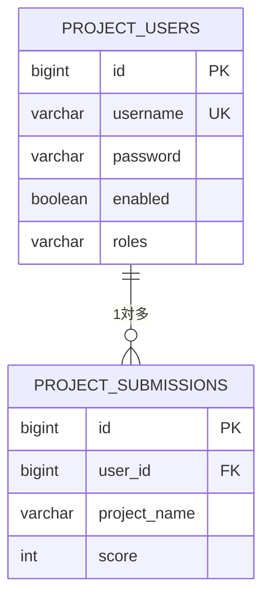

# ER図

## テーブル説明

### project_users（ユーザー情報）
- `id` - 主キー（BIGINT）
- `username` - ユーザー名（VARCHAR, UNIQUE）
- `password` - パスワード（VARCHAR）
- `enabled` - 有効フラグ（BOOLEAN）
- `roles` - ロール（VARCHAR）

### project_submissions（課題提出）
- `id` - 主キー（BIGINT）
- `user_id` - ユーザーID（BIGINT, 外部キー）
- `project_name` - プロジェクト名（VARCHAR）
- `score` - スコア（INT）

## 関連性
- 1人のユーザーが複数の課題を提出可能（1対多）
